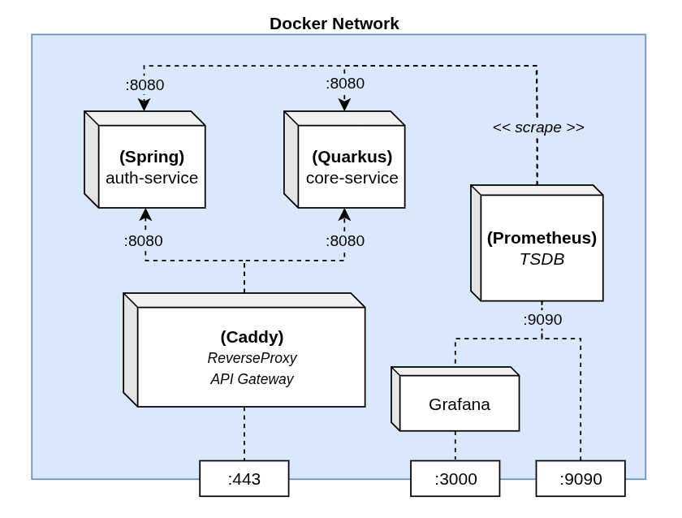

# Sandbox Microservices

Projeto de estudo para aplicar conhecimentos em Arquitetura de Microserviços e Observabilidade.

## Tecnologias

- Servidor Caddy
- Java + Spring Framework
    - Spring Boot
    - Spring Security
    - Spring Actuator
    - OAuth & JWT
- Kotlin + Quarkus Framework
    - Micrometer
- OpenSSL (RSA Keys Generator)
- Docker & Docker Compose
- PostgreSQL & Redis

## Como executar

1. Gere o par de chaves RSA no microserviço de autenticação.
````bash
cd auth-service/src/main/resources
openssl genrsa > app.key
openssl rsa -in app.key -pubout -out app.pub
````

2. Execute os containers
````bash
docker compose -f docker-compose-dev.yaml up -d --build
````

- prometheus: http://localhost:9090
- grafana: http://localhost:3000
- auth-service: https://localhost/auth/*
- core-service: https://localhost/core/*


## Serviços

### Gateway
Configurações do servidor Caddy, atuando como Proxy Reverso e API Gateway para os demais serviços.

### Auth Service
Microserviço de autenticação em Java, lidando com OAuth + JWT e Criptografia Assimétrica com chaves RSA. Expõe métricas com Spring Actuator + Micrometer.

### Core Service
Microserviço leve em Kotlin + Quarkus. Expõe métricas com a extensão _micrometer-registry-prometheus_.

### Prometheus
Serviço **TSDB** (Time Series Database) para lidar com métricas, realizando **scrape** nos microserviços.

### Grafana
Serviço para visualização de métricas gerenciadas pelo _Prometheus_ tem tempo real.

---

## Arquitetura




---

_Made with ☕ by **Filipe Martins**_
